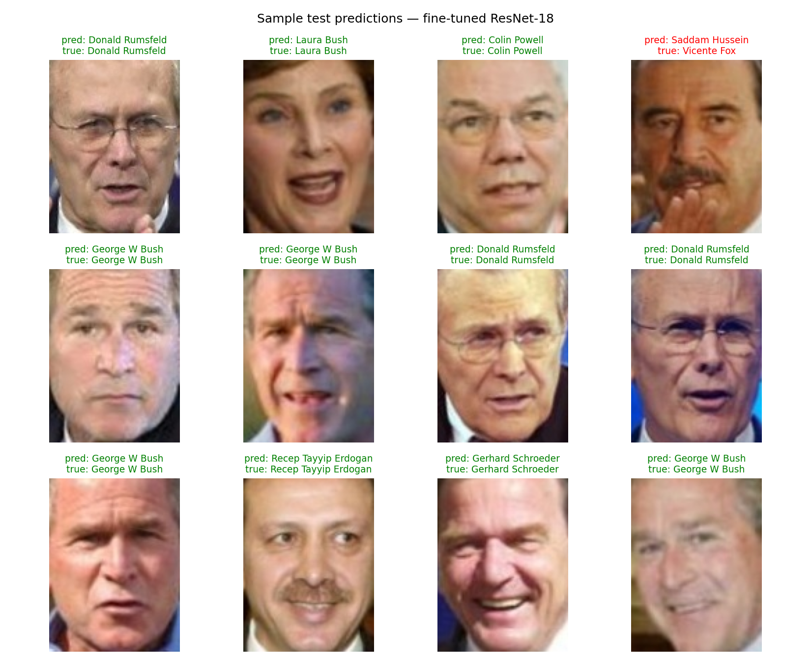
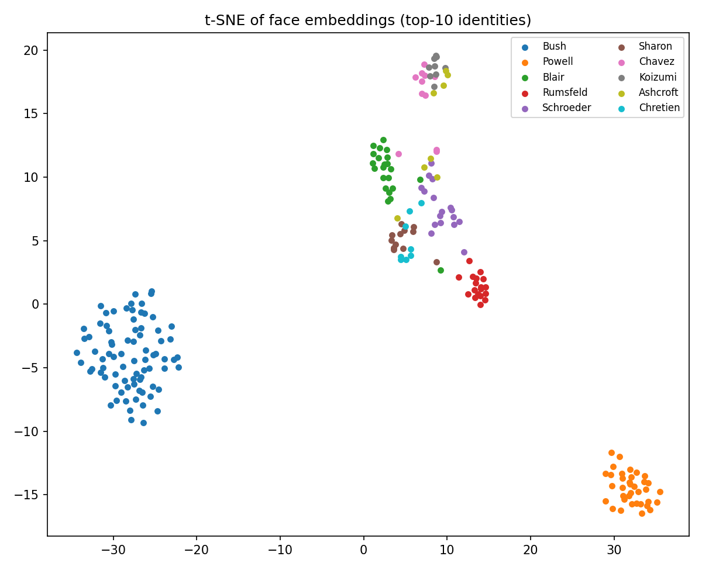
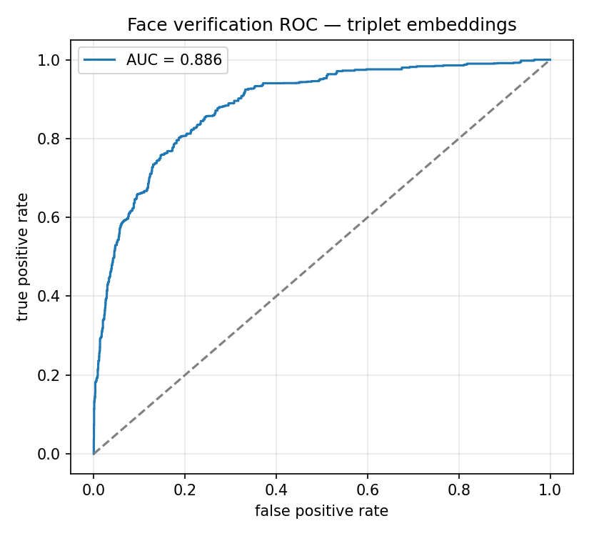
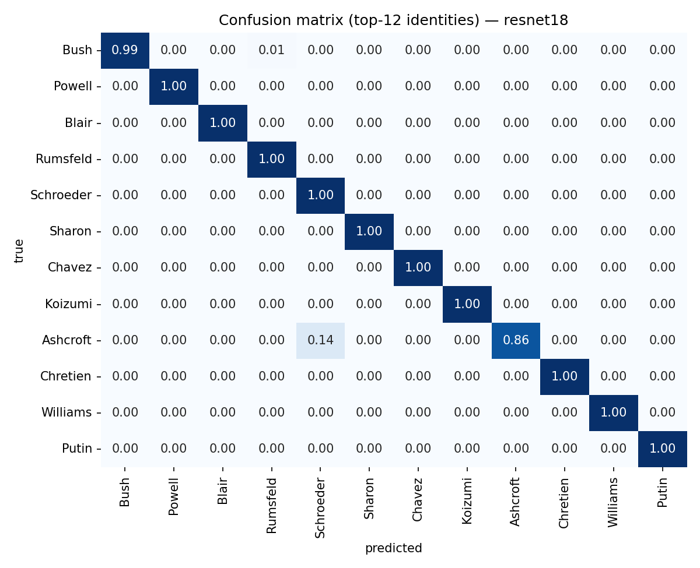

# Face Recognition with Deep Learning

End-to-end face recognition on the [LFW (Labeled Faces in the Wild)](http://vis-www.cs.umass.edu/lfw/) dataset, built with PyTorch. The project compares three approaches of increasing sophistication:

1. **CNN from scratch** — a compact convolutional baseline trained end-to-end
2. **Transfer learning** — an ImageNet-pretrained ResNet-18 fine-tuned for face identification
3. **Deep metric learning** — a triplet-loss embedding network that maps faces to a 128-d unit hypersphere, enabling **face verification** ("are these two photos the same person?") and k-NN identification of identities

## Results

Held-out test split (15% of 3,023 images, 62 identities, stratified):

| Model | Test accuracy | Macro F1 | Top-5 accuracy |
|---|---|---|---|
| CNN from scratch | 20.5% | 0.169 | 49.6% |
| **ResNet-18 (fine-tuned)** | **93.0%** | **0.895** | **98.0%** |

| Embedding model | 5-NN accuracy | Verification ROC-AUC |
|---|---|---|
| Triplet network (128-d) | 68.3% | 0.886 |

Trained entirely on CPU (~45 min total). The 4.5× gap between the scratch CNN and the fine-tuned ResNet-18 is the transfer-learning story in one table.

### Sample predictions


### Embedding space (t-SNE)
The triplet network clusters identities without ever training a classifier:



### Face verification ROC


### Confusion matrix — fine-tuned ResNet-18


## Approach

### Data
- **LFW funneled**, colour, 62 identities with ≥ 20 images each (3,023 images, 125×94)
- Stratified 70/15/15 train/val/test split
- Augmentation: random horizontal flip, ±10° rotation, colour jitter
- **Class imbalance** (the largest identity has ~18% of all images) is countered with inverse-frequency class weights in the loss

### Models
| | Architecture | Loss | Notes |
|---|---|---|---|
| `scratch` | 4 double-conv blocks (32→256) + GAP | Weighted cross-entropy | ~1.6 M params |
| `resnet18` | ResNet-18, ImageNet weights, new head | Weighted cross-entropy | Full fine-tune, low LR |
| `triplet` | ResNet-18 backbone → 128-d L2-normalised embedding | Triplet margin (α = 0.3) | Random triplet sampling |

All models train with AdamW + cosine LR schedule; the best checkpoint is selected on validation accuracy (classifiers) or validation triplet loss (embeddings).

### Evaluation
- Classifiers: accuracy, macro-F1, top-5 accuracy, per-class report, confusion matrix
- Embeddings: 5-NN classification accuracy (cosine), same/different-pair verification ROC-AUC, t-SNE visualisation

## Project structure

```
├── src/
│   ├── config.py          # paths & hyperparameter constants
│   ├── data.py            # LFW loading, splits, transforms, triplet sampling
│   ├── models.py          # SimpleCNN, ResNet-18 transfer, EmbeddingNet
│   ├── train.py           # classifier training CLI
│   ├── train_triplet.py   # metric-learning training CLI
│   ├── evaluate.py        # test metrics + all figures
│   └── predict.py         # single-image inference CLI
├── reports/
│   ├── figures/           # generated plots (committed)
│   └── *.txt / *.json     # classification reports & metrics
└── requirements.txt
```

## Reproduce

```bash
pip install -r requirements.txt

# LFW downloads automatically on first run (~230 MB)
python -m src.train --model scratch  --epochs 15
python -m src.train --model resnet18 --epochs 10
python -m src.train_triplet --epochs 8

python -m src.evaluate --model all
python -m src.predict path/to/face.jpg --model resnet18
```

Trains on CPU in under an hour; uses CUDA automatically when available.

## Key takeaways

- **Transfer learning dominates from-scratch training** on small datasets — ImageNet features transfer remarkably well to faces despite the domain gap.
- **Metric learning generalises differently than classification**: the triplet network never sees a softmax over identities, yet its embedding space separates people cleanly enough for high-AUC verification — and it extends to *unseen* identities without retraining, which a closed-set classifier cannot do.
- **Class weighting matters**: LFW is heavily skewed (530 images of one identity vs. 20 of many), and unweighted training quietly sacrifices the rare classes.

## License

MIT
